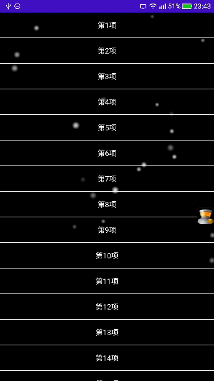

This project introduce a way to implement a dynamic background in Android .

## (1)Effect Diagram
Here is the effect diagram :

It's combined with ListView and a snowing background . You can replace ListView with any other Views .

## (2)Not in the UI thread
The dynamic background is implemented in a separate thread , not the UI thread . So , it has no impact on the UI thread.